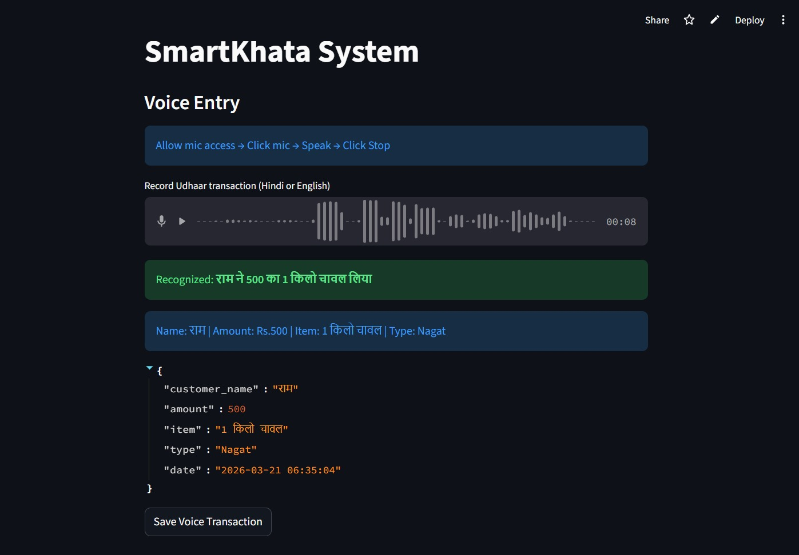

# SmartKhata — Voice & AI-Powered Udhaar Ledger

> **Live Demo:** [smartkhata-rrzrwyaqjpaspzfvhnmigk.streamlit.app](https://smartkhata-rrzrwyaqjpaspzfvhnmigk.streamlit.app)

A production-deployed debt-tracking system for small shopkeepers who manage Udhaar (credit) verbally in Hindi/English. Replaces paper-based ledgers with real-time, voice-driven data entry backed by LLM extraction and Firebase persistence.



---

## Problem

Local shopkeepers in India track Udhaar (customer credit) in physical notebooks. Entries get missed during rush hours, ledgers get lost, and there is no way to quickly query a customer's outstanding balance.

| Traditional Method | SmartKhata |
|---|---|
| Manual notebook entry | Voice or form entry in ~3 seconds |
| No search — flip pages | Name search with instant ledger view |
| No balance calculation | Auto-calculated Udhar / Paid / Net |
| Lost if notebook damaged | Cloud-persisted, always recoverable |
| Literacy required | Voice input, no typing needed |

---

## Impact

- Reduces transaction entry time from ~10–15 seconds (manual writing) to ~3–5 seconds (voice)
- Eliminates missed entries during peak shop hours — no pen, no paper needed mid-transaction
- Instant balance lookup vs manually scanning notebook pages for a customer's history
- Makes credit tracking accessible for low-literacy users — entire workflow is voice-driven
- Cloud persistence means no data loss if the physical notebook is damaged or lost

---

## Architecture

```
Browser mic → st.audio_input()
      ↓
pydub (WebM → WAV conversion)        ← format mismatch fix
      ↓
Google Speech Recognition (hi-IN → en-IN fallback)
      ↓
Groq LLaMA 3.1-8B (structured JSON extraction)
      ↓  (regex fallback if LLM call fails)
Transaction object
      ↓
Firebase Realtime DB
      ↓
Streamlit UI — search / ledger / Plotly charts
```

**OOP Layer Structure:**

```
domain/           → Transaction           (pure data model, no deps)
infrastructure/   → FirebaseRepository    (DB access)
                  → GroqExtractor         (LLM + regex fallback)
                  → SpeechEngine          (local mic, dev only)
services/         → TransactionService    (business logic, search, analytics)
                  → VoiceService          (orchestrates listen → extract → save)
main.py           → UI layer + dependency injection
```

---

## Sample Input → Output

**Example 1 — Udhar entry:**
```
Spoken: "Ram ne 500 ka chawal udhar liya"

Output:
{
  "customer_name": "Ram",
  "item": "chawal",
  "amount": 500,
  "type": "Udhar",
  "date": "2026-03-20 14:32:07"
}
```

**Example 2 — Payment entry:**
```
Spoken: "Shyam ne 200 wapas diya"

Output:
{
  "customer_name": "Shyam",
  "item": "udhar chukaya",
  "amount": 200,
  "type": "Paid",
  "date": "2026-03-20 15:10:44"
}
```

**Example 3 — Regex fallback (Groq unavailable):**
```
Spoken: "300 ka tel liya Mohan ne"
→ Groq call fails (timeout / rate limit)
→ regex detects "ने" keyword → name = "Mohan"
→ detects amount via \b(\d{1,5})\b → 300
→ no udhar/paid keyword → type = "Nagat"
```

<!-- GIF: Record a 10-second screen capture: click mic → speak → see JSON → save -->

---

## Key Engineering Decisions

### 1. Browser-side audio capture
Cloud servers are headless — `pyaudio` + `sr.Microphone()` throws `OSError: No Default Input Device` on any cloud platform. Replaced with `st.audio_input()` which captures in the browser and sends audio as a binary file. Server processes a file, never touches hardware.

### 2. Audio format conversion (WebM → WAV)
Browsers record in WebM/OGG. `SpeechRecognition` only accepts WAV. `pydub` + `ffmpeg` sits between capture and transcription as a conversion layer. Without this, every voice entry silently fails.

### 3. LLM extraction with structured prompting + fallback

**Prompt design:** Fixed output schema enforced in the system prompt:
```
Extract JSON ONLY — fields: customer_name, item, amount (numeric), type (Udhar/Paid/Nagat)
Rules:
- "Paid"  → payment keywords present (chukaya, wapas)
- "Udhar" → "udhar" keyword present
- "Nagat" → everything else
```
`temperature=0` eliminates creative variation for consistent JSON output.

**Error handling chain:**
```
Groq call → parse JSON → strip markdown fences → return dict
     ↓ (any exception)
Regex fallback → Hindi keyword matching → return best-effort dict
```
No call ever returns `None` — the fallback guarantees a `Transaction` object is always produced.

### 4. Secrets management
`st.secrets` on Streamlit Cloud, `.env` + JSON file path locally. A single `get_config()` function handles both — no environment-specific branching anywhere else in the codebase.

### 5. Dual-mode Firebase initialisation
`FirebaseRepository.__init__` checks `isinstance(creds, dict)` — dict means cloud (from `st.secrets`), string means local file path. `firebase_admin._apps` guard prevents re-initialisation on Streamlit reruns, which throws `ValueError: The default Firebase app already exists`.

### 6. Unicode-normalised name matching
Voice-transcribed Hindi names can have different Unicode representations of the same character (NFC vs NFD). `TransactionService` applies `unicodedata.normalize('NFC', ...)` before comparison — prevents duplicate ledgers for the same customer.

---

## Results & Performance

> Based on manual testing across ~50 transactions during development.

| Metric | Result |
|---|---|
| End-to-end voice → saved | ~3–5 seconds |
| Google Speech accuracy (clear Hindi) | ~85–90% |
| LLM extraction accuracy (well-formed input) | ~90%+ |
| Regex fallback trigger rate | ~10–15% of calls |
| Regex fallback accuracy | ~70% (degrades on complex sentences) |
| Firebase write latency | <500ms |
| Streamlit Cloud cold start | ~15–20 seconds (free tier) |

---

## Failure Cases & Limitations

| Failure | Cause | Current Behaviour |
|---|---|---|
| Background noise | Google STT returns corrupted text | LLM extracts wrong data — no confidence threshold |
| Spoken amounts ("ek sau pachas") | Words, not digits | Regex misses; LLM inconsistent |
| Same name, different spelling ("Ram" vs "Raam") | No fuzzy matching | Two separate ledgers created |
| Mixed script ("Ram ne 5 सौ liya") | Digit-word mixing | Regex fails; LLM usually handles |
| Groq rate limit | Free tier quota | Silent fallback to regex |
| Streamlit cold start | Free tier spins down after inactivity | ~20s wait on first visit |

---

## Features

| Feature | Technical Detail |
|---|---|
| Voice entry | Browser mic → WebM → WAV → Google STT → Groq LLM → `Transaction` object |
| Manual entry | Form-based, same `Transaction` schema, same save path as voice |
| Customer ledger | NFC-normalised name search, splits Udhar / Paid, calculates net balance |
| Analytics dashboard | Date-filtered metrics (Udhar, Paid, Net, active customers), top-5 debtor bar chart, daily Udhar trend line, transaction volume — all via `st.tabs` + `st.metric` |
| Bilingual STT | `hi-IN` first, falls back to `en-IN` on `UnknownValueError` |
| LLM fallback | Regex + Hindi keyword parser fires automatically, transparent to user |
| PDF export | Per-customer A4 statement — KPI summary, itemised Udhar/Paid tables, downloadable via `st.download_button` |

---

## Tech Stack

| Layer | Technology | Why This |
|---|---|---|
| UI & hosting | Streamlit | `st.audio_input` solves the cloud mic problem; no frontend needed |
| Speech-to-text | Google Speech Recognition | Free, no API key, native `hi-IN` support |
| LLM extraction | Groq LLaMA 3.1 8B Instant | ~200ms inference, free tier, handles Hinglish |
| Database | Firebase Realtime DB | JSON-native, no schema setup, free tier sufficient |
| Audio conversion | pydub + ffmpeg | Only reliable WebM→WAV option on Linux |
| Visualisation | Plotly Express | Interactive charts, no JS |

---

## Local Setup

```bash
git clone https://github.com/rohannegi-2005/SmartKhata
cd SmartKhata
pip install -r requirements.txt

# Install ffmpeg (required for audio conversion)
sudo apt install ffmpeg        # Ubuntu/Debian
brew install ffmpeg            # macOS

# Create .env
GROQ_API_KEY=your_groq_key
FIREBASE_JSON_PATH=path/to/serviceAccount.json

streamlit run main.py
```

**Requirements:** Python 3.9+, ffmpeg on system PATH

---

## Deployment Notes

Deployed on Streamlit Cloud (free tier). Three non-obvious blockers solved:

1. **`pyaudio` build failure** — `portaudio` headers missing on Streamlit's Linux image. Removed `pyaudio` entirely; `packages.txt` installs system-level `ffmpeg` and `portaudio19-dev` for `pydub`.
2. **`st.audio_input()` version gate** — available only from `streamlit>=1.31.0`. Pinned in `requirements.txt` to prevent silent rollback.
3. **Firebase re-init crash on reruns** — Streamlit reruns the full script on every interaction. Added `if not firebase_admin._apps` guard to prevent `ValueError` on re-initialisation.

---

## Scalability Considerations

Current architecture is intentionally scoped to a single-shop deployment. Known constraints at scale:

| Concern | Current State | At Scale |
|---|---|---|
| Database | Firebase Realtime DB — low latency, but flat JSON structure | Complex queries (date ranges, multi-customer aggregations) degrade; Firestore or PostgreSQL better suited |
| Concurrency | Single user assumed — no auth layer | Multi-tenant requires user-level data partitioning and auth |
| LLM dependency | Groq free tier — rate limited | Needs paid tier or self-hosted model for production traffic |
| Name deduplication | Exact NFC-normalised match | Fuzzy matching (Levenshtein / phonetic) required at scale |
| Analytics | In-memory pandas aggregation on full dataset fetch | Needs server-side aggregation queries as data grows |

A production multi-shop version would require authentication, per-shop data isolation, and likely a migration from Firebase Realtime DB to Firestore or a SQL-based system.

---

## What's Next

- [ ] Fuzzy name matching — treat "Ram" / "Raam" / "राम" as the same customer
- [ ] STT confidence threshold — reject low-confidence transcriptions before LLM call
- [ ] WhatsApp notification when customer balance crosses a threshold
- [ ] Multi-shop support with authentication
- [ ] Offline-first mode with background sync on reconnect

---

## Author

**Rohan Negi** — [github.com/rohannegi-2005](https://github.com/rohannegi-2005)